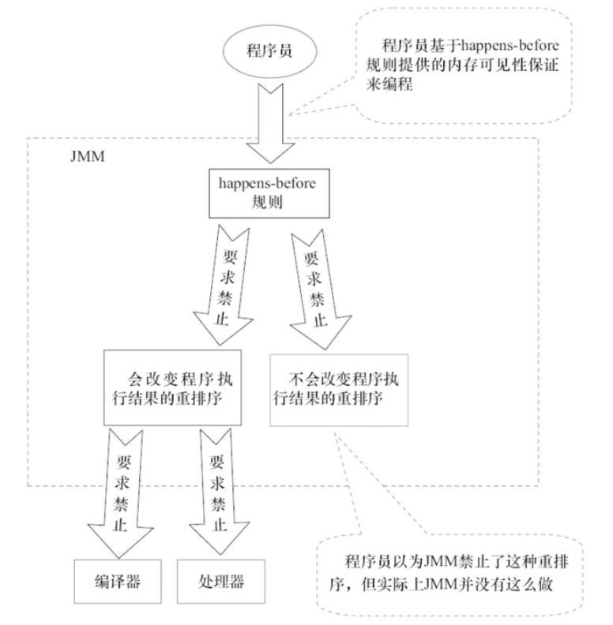

# 并发（1）

### 多线程就一定会提高效率吗？

任务性质上来说：分为CPU密集型和IO密集型

对于**CPU密集型**优势并不大。多线程的使用本质就是提高CPU的使用率，提高资源利用率。而对于单核来说。其计算能力是一定的，所以本质上并不会加快运算，反而会因为线程的调度开销，从而进一步降低效率。

对于IO密集型，会有效率的提升。因为IO密集型的时间瓶颈主要在等待IO资源的交互。而单线程场景下，CPU会在等待的这一段时间内空闲。反之，多线程情境下，可以更有效的减少CPU的空闲时间：**在线程等待IO资源的时候，调度CPU执行其他任务，避免CPU的空闲。**

从另外一个角度看，多线程只是为了利用系统的资源。适用即可，不需要开很多。线程的切换，创建销毁等成本也需要计算在内。


### 使用多线程可能会带来什么问题

首先就是结果的不确定性。多线程具有异步性，其程序的结果在部分情境下是不可预测的。（但是我们可以将不同情境下的所有情况拓扑出来做归纳分析）

然后，假如线程内存使用不当（ThreadLocal等），会带来内存泄漏，最终可能会造成内存溢出的问题。

假如线程之间有临界资源，就会有概率出现死锁，或者线程之间的竞态问题。（值逻辑不同步）。

**怎么思考？**运行中会操作数据，操作共享数据的话可能死锁或逻辑不一致，操作完后可能会内存泄漏...


### 线程安全？

逻辑状态的一致与不一致


### 死锁的四个必要条件

互斥：操作资源是临界资源，同时只能被一个线程修改

抢占性：具有强占特性，操作结束前不能被其他线程抢夺操作权（只能yield() or 外部syscall）

占有资源并等待：持有资源，并且会锁住他一段时间（执行代码的时间）

循环等待：所需资源之间形成循环等待关系


### 如何检测死锁

**约等于查看占用**

日志分析

jstat 有死锁会有`Found one Java-level deadlock:`

top,df,free看占用


### 并发编程三大特性

可见：当读取静态变量等共享资源的时候，保证是读取到它的最新值。

有序：指令执行的顺序有可能会由于编译器处理器内存的优化而修改运行的顺序。which仅仅保证单线程语义一致，没保证多线程环境下的予以一致。

原子：仅有一个线程可以访问代码块，保证原子性。


### JMM

无需多言

CPU下方接着寄存器

寄存器下方接着CPU告诉缓存，一般分为L1-L3

L1-L3下即为内存（堆）

所谓的线程不安全，就是由于CPU高速缓存的存在。在高并发环境下，它有几率与主存的内容（最新值）逻辑不一致。

此时就会导致部分静态变量等读取不到最新值。


### 指令重排序

重排序包括

**编译器重排序**：编译器会在不改变原有语言前提下，为了提高效率重写语句，有可能改变原有语句顺序。

**处理器并行重排（多语句同时执行）**：现代处理器可以判断出某几个语句之间不存在交集（没有状态转移的直接关系），会同时执行这两个指令。

**· 内存重排序**：CPU的L1-L3缓存之间也需要同步，同步是根据他们之间的CPU缓存一致性协议来操作的。而这个一致性协议的实现有可能会延迟。就造成了**线程观察到的内存更新顺序不一致**

重排序的坑就是在编译器和处理器虽然能保证重排序之后程序输出的结果是一样的。但是这个是在单线程的前提下，多线程的场景下，有可能会打破这个重排序的正确性。


### JMM的作用？

为程序员与操作系统之间产生于一层抽象的隔离层。

将操作系统中相关的概念抽象出来，让大多数情况下，程序只需要知道抽象出的方法或变量的类型即可开发出安全高可用的程序。


### 对于JMM中主内存和CPU高速缓存中的关系

上方已经说过有可能因为两个介质逻辑的不一致性，而导致多线程环境下，程序运行出错。

对于将数据从主存与工作内存之间的同步。JMM也有定义一系列的原子操作（个人人为可以类比成原子操作）

除了定义缓存与主存之间的数据交互，他们之间也有一定的协议进行规范。

> 除了这 8 种同步操作之外，还规定了下面这些同步规则来保证这些同步操作的正确执行：
>
> - 不允许一个线程无原因地（没有发生过任何 assign 操作）把数据从线程的工作内存同步回主内存中。
> - 一个新的变量只能在主内存中 “诞生”，不允许在工作内存中直接使用一个未被初始化（load 或 assign）的变量，换句话说就是对一个变量实施 use 和 store 操作之前，必须先执行过了 assign 和 load 操作。
> - 一个变量在同一个时刻只允许一条线程对其进行 lock 操作，但 lock 操作可以被同一条线程重复执行多次，多次执行 lock 后，只有执行相同次数的 unlock 操作，变量才会被解锁。
> - 如果对一个变量执行 lock 操作，将会清空工作内存中此变量的值，在执行引擎使用这个变量前，需要重新执行 load 或 assign 操作初始化变量的值。
> - 如果一个变量事先没有被 lock 操作锁定，则不允许对它执行 unlock 操作，也不允许去 unlock 一个被其他线程锁定住的变量。


### JAVA内存区域 & JMM

内存区域指的是：栈堆本地内存等分布。侧重点在分析Java运行时，不同抽象的数据和信息的存储分布

JMM：Java运行的多线程模型。本质上是描述运行时CPU与工作线程交互时的运行链路。并且描述Java在应对多并发情况时，所作的设计。


### 关于happens-before

什么东西？ 一种设计思想

规定某个操作必须要在规定的前置操作后再执行。（逻辑顺序）

解决的问题？分布式环境下的逻辑一致性问题与Java内存模型下的指令重排约束。

分布式环境下，会存在时钟的问题，每个服务本身会有一个局部时钟。但是他们之间不一定是精确同步的，可能会存在延迟等问题。这时候就出现了全局时钟，时钟回拨等思想。

happen-before在这一场景下就是规定了多服务间临界资源必须在A执行完后B才能执行。可以说互斥某种程度上就是happens-before的一种实现。

类比到JMM中，即是规定了。当某几段临界区代码存在并发问题的时候，这时候程序员会使用volatile synchronized等变量保证了happens-before原则。并且在程序员角度上，抽象认为他是不会重排序的。但是在操作系统底层，他仅仅根据happens-before这一原则，判断出临界资源的影响区域。并且仅仅取消该部分的重排序。其他部分该优化还是优化。




### volatile

#### 能保证原子性吗？

不可以！

他只能保证读取到的是最新版本的值（保证变量的可见性）。不能保证对变量的操作是原子的。


### 乐悲观锁

见名知意

乐观 & 悲观在于的是它是否被修改

乐观锁：**乐观猜测数据没有被修改**，使用CAS版本号机制。在操作的时候，读取前先写一个标识符。操作完后，判断这个标识符有没有被修改。如果有，则代表消息被修改了，重新读取，或者选择兜底策略，上锁等。在修改的时候，本质上是允许其他线程同步操作，因此一般适用于**高频读情景**。

悲观锁：**高频写，悲观认为数据总是被修改过。**使用synchronized或reentrantlock等方式上强制锁。上锁的时候原子操作，不可抢占。


### AutoInteger & LongAddr

AutoInteger是使用乐观锁实现的 whichmeans 在高并发情况下 它的执行效率可能会较低

这时候我们可以使用它的牛逼版 LongAddr。LongAddr由多个AutoInteger组成。它的本质上就是对于不同的线程变量，将写操作分散到多个AutoInteger 变量（他们关这叫桶）。在读取值的时候，再将这些值累加起来。

典型的分片、 空间换时间的策略。

### 版本号

操作前分配版本号，短期的唯一标识即可

操作后判断是否相等。

### CAS算法

算法的思想同样是判断过了一段时间之后，有没有被第三方修改

操作前读取临界值作为预期值

（这个预期是指操作后，没有修改的话，想要读到的值应该是多少）

但是假如在这个过程中，被修改了。（每一次修改的时候，都会附带修改临界值）

他所读到的值，就和预期值是不一样的。此时就需要执行兜底策略（重试或自旋等）

Java中提供了c++的本地实现，为

`sun.misc`包下的`Unsafe`类提供了`compareAndSwapObject`、`compareAndSwapInt`、`compareAndSwapLong`方法来实现的对`Object`、`int`、`long`类型的 CAS 操作


```java
/**
  *  CAS
  * @param o         包含要修改field的对象
  * @param offset    对象中某field的偏移量
  * @param expected  期望值
  * @param update    更新值
  * @return          true | false
  */
public final native boolean compareAndSwapObject(Object o, long offset,  Object expected, Object update);

public final native boolean compareAndSwapInt(Object o, long offset, int expected,int update);

public final native boolean compareAndSwapLong(Object o, long offset, long expected, long update);
```


### ABA问题

CAS的时候是将某个值从A修改成了B。然后根据值的变化来判断它是否曾经被修改过。并没有判断它的修改轨迹

引出了ABA问题，假如某个值A先被修改成了B，然后再次修改成了A。此时经过两次修改后的它的本身逻辑的第一次的A是不一样的。但是CAS返回的时候，并不知道，以它的状态切换视角只会判断值为预期值。然后继续执行。

所以会使用到**版本号和时间戳**进行配合。

版本号保证了唯一。时间戳标识类似的递增唯一。我的筋斗云就是这么干的。

但是在分布式环境下，会有时钟回拨的问题。这种情境下就可以，定一个全局时钟，然后定时任务，定时同步每个服务中的时钟。又或者是直接上雪花id之类的东西。


